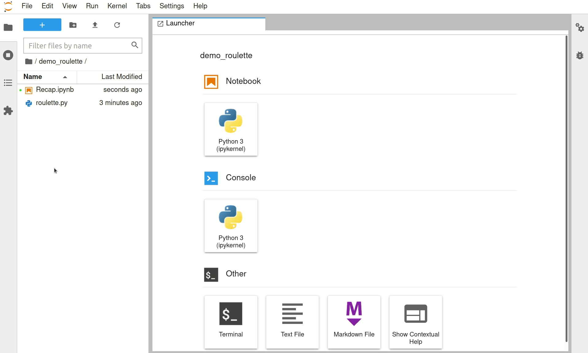

# The Recap Roulette

A tiny script for Le Wagon Data teachers to play with during Recap sessions.  
Inspired by the roulette from the Web bootcamp. 

## How to use it

1. Download the `roulette.py` file and place it next to your Recap jupyter notebook.
2. Edit the file to fill the list of the `STUDENTS` of your batch
3. (Optional) Share the edited file to your `batch-XXX-teachers` Slack channel
4. At the top of your Recap notebook, add a call with this code to execute **only once**:
``` python
from roulette import STUDENTS, rien_ne_va_plus

hot_seats = STUDENTS.copy()
safe_seats = []
```
5. Then, create this cell that you will execute **every time** you need to roll for a new question (just move the same cell across the notebook):
``` python
hot_seats, safe_seats = rien_ne_va_plus(hot_seats, safe_seats)
``` 

## Demo


